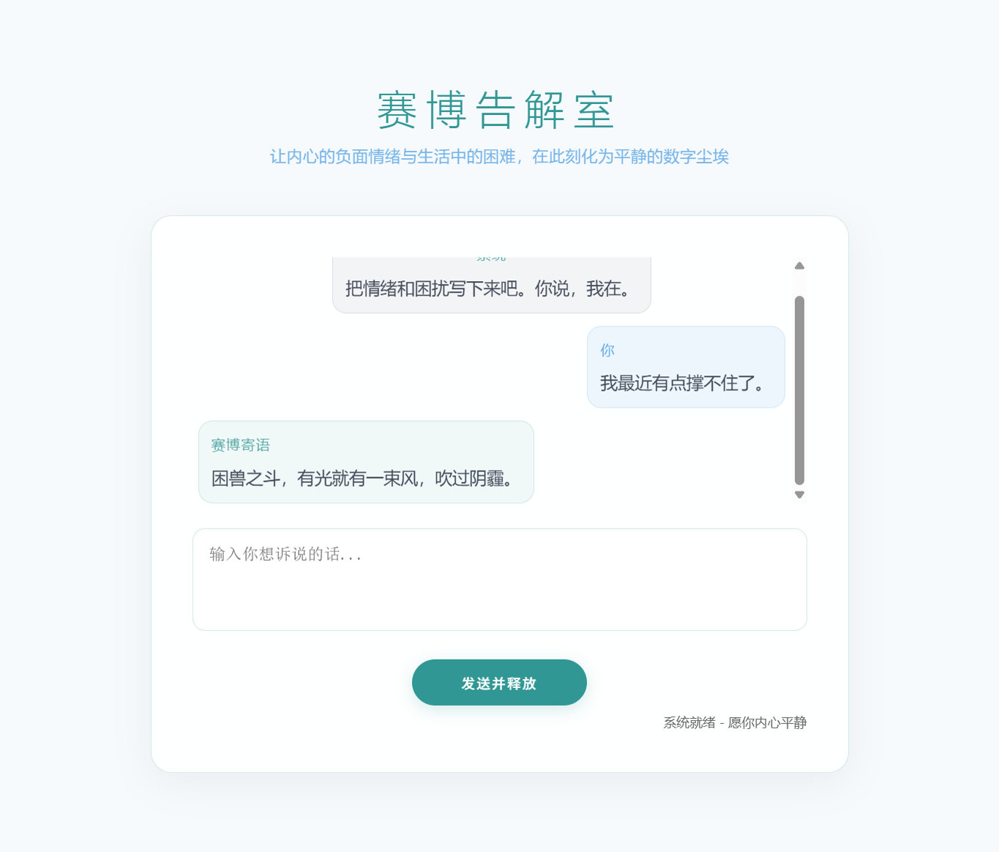

# 赛博告解室 | Cyber Confession Room

一个结合了 AI 情感陪伴、数字化叙事与情绪释放的虚拟空间。旨在为现代人提供一个隐私、解压且具有仪式感的心理疏导平台。在这里，内心的负面情绪与生活中的困难都将化为平静的数字尘埃。

## ✨ 核心特性

- **赛博告解师 (AI Confessor)**：基于大语言模型，提供柔和、温润且充满包容心的情感反馈。
- **清爽视觉设计**：采用极简主义风格，搭配宁静的淡青色调与流动的背景星空，营造平和的告解氛围。
- **情绪释放仪式**：文字输入后触发“数字崩解”动效，模拟情绪随风而逝的视觉体验。
- **双重部署方案**：支持本地 Ollama 私有化部署（极致隐私）及云端 API 高效调用。

## 🖼️ 示例截图



## 🛠️ 技术栈

- **后端**：Python / Flask
- **前端**：HTML / CSS / JavaScript (原生 Canvas 动画)
- **AI 模型支持**：OpenAI 兼容接口 (Ollama / DeepSeek / GPT 等)

## 🚀 部署方式

### 方案一：本地 Ollama 部署 (推荐，极致隐私)

适合拥有本地 GPU（如 RTX 30/40/50 系列）且重视隐私的用户。

1. **安装 Ollama**：
   前往 [ollama.com](https://ollama.com) 下载并安装。
2. **拉取模型**：
   在终端运行（建议 16G 显存用户拉取 14B 模型）：
   ```bash
   ollama pull qwen2.5:7b  # 或 qwen2.5:14b
   ```
3. **配置应用**：
   修改 `app.py` 中的配置：
   ```python
   BASE_URL = "http://127.0.0.1:11434/v1"
   API_KEY = "ollama"
   MODEL_ID = "qwen2.5:7b"
   ```
4. **启动服务**：
   ```bash
   python app.py
   ```

### 方案二：云端 API 调用 (简单快捷)

适合没有本地高性能显卡，希望快速上手的用户。

1. **获取 API Key**：
   获取任意 OpenAI 兼容服务的 API Key（如 OpenAI, DeepSeek, 智谱 AI 等）。
2. **配置应用**：
   修改 `app.py` 中的配置：
   ```python
   BASE_URL = "https://api.your-provider.com/v1"
   API_KEY = "your-api-key-here"
   MODEL_ID = "gpt-4o" # 或其他模型 ID
   ```
3. **启动服务**：
   ```bash
   python app.py
   ```

## 📦 快速开始

1. **克隆项目**：
   ```bash
   git clone <repo-url>
   cd cyber-confession-room
   ```
2. **安装依赖**：
   ```bash
   pip install flask openai
   ```
3. **运行**：
   ```bash
   python app.py
   ```
4. **访问**：
   打开浏览器访问 `http://127.0.0.1:5000`。

## 📝 许可证

MIT License
